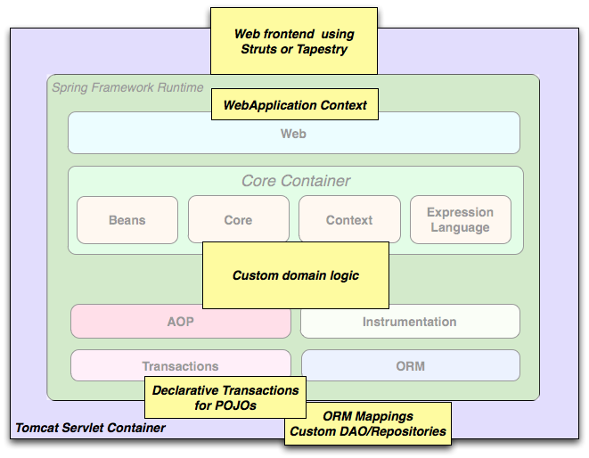
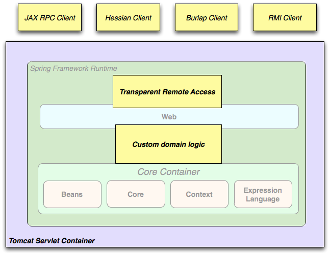

### 2.3 使用场景

前面描述的构建模块使Spring成为许多场景下的合理选择，从在资源受限的设备上运行的嵌入式程序到使用Spring事务管理功能和web框架集成的完整的企业级应用。

**Figure 2.2. Typical full-fledged Spring web application**

Spring的[声明式事务管理功能](../V.Data_Access/17.5.Declarative_transaction_management.md)使Web应用程序完全事务化，就如同使用EJB容器管理的事务一样。您所有自定义的业务逻辑都可以用简单的POJO来实现，并通过Spring的IoC容器来管理。附加的服务还包括对发送邮件及校验的支持，校验是独立于Web层的，允许您选择在哪里执行校验规则。Spring集成JPA、Hibernate和JDO提供对ORM的支持，举例来说，在使用Hibernate时，您可以继续使用现有的映射文件和标准Hibernate的`SessionFactory`配置。表单控制器将领域模型和Web层无缝集成，无需`ActionForm`或其他类来将HTTP参数转换为领域模型的值。

**Figure 2.3. Spring middle-tier using a third-party web framework**

有时，情况不允许您彻底地转换到不同的框架。Spring Framework并*不*强迫您使用它的每一个部分，它并不是一个*全有或全无*的解决方案。使用Struts、Tapestry、JSF或其他UI框架构建的现有前端可以与基于Spring的中间层集成，从而使您可以使用Spring的事务功能。您只需要用`ApplicationContext`来连接业务逻辑，并使用`WebApplicationContext`来整合Web层。

**Figure 2.4. Remoting usage scenario**

当您需要通过Web服务来访问现有代码时，可以使用Spring的`Hessian-`、`Burlap-`、`Rmi-`或`JaxRpcProxyFactory`类。启用对现有应用程序的远程访问并不困难。

**Figure 2.5. EJBs - Wrapping existing POJOs**

Spring Framework还为Enterprise JavaBeans提供了一个[访问和抽象层](..VII.Integration/29.Enterprise_JavaBeans_\(EJB\)_integration.md)，使您可以重用现有的POJO，并将它们包装在无状态会话bean中，以用于可伸缩的、故障安全的、可能需要声明式安全性的Web应用程序中。
