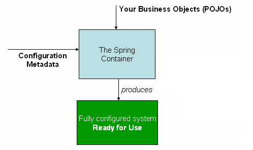

### 7.2 容器概览

接口`org.springframework.context.ApplicationContext`代表Spring的IoC容器，负责实例化、配置和组装前面提及的bean。容器通过读取配置元数据来获取对哪些对象进行实例化、配置和组装的指令。配置元数据以XML、Java注解或Java代码的形式表示，它可以描述组成您应用的对象以及这些对象间丰富的相互依赖关系。

Spring提供了几种`ApplicationContext`接口的实现。在独立的应用程序中，通常会创建`ClassPathXmlApplicationContext`或`FileSystemXmlApplicationContext`的实例。虽然XML是定义配置元数据的传统格式，但是您可以通过提供少量的XML配置以声明的方式启用对其他元数据格式的支持来指示容器使用Java注解或代码作为元数据的格式。

在大多数的应用场合，不需要显式的用户代码来实例化一个或多个Spring IoC容器的实例。例如，在Web应用程序中，`web.xml`文件的一段简单的八行左右的Web描述XML样板（boilerplate）通常就足够了（参见[7.15.4 Web应用的便捷ApplicationContext实例化](7.15.4.Convenient_ApplicationContext_instantiation_for_web_applications.md)）。如果使用基于Eclipse的[Spring工具套件](https://spring.io/tools/sts)开发环境，则只需几下鼠标点击或键盘输入就能轻易地创建这段样板配置。

下面的图从上层展示了Spring如何工作。程序中的类与配置元数据相结合，使得在`ApplicationContext`被创建和初始化之后，您能得到一个完全配置的且可执行的系统或应用。

**Figure 7.1. The Spring IoC container**

